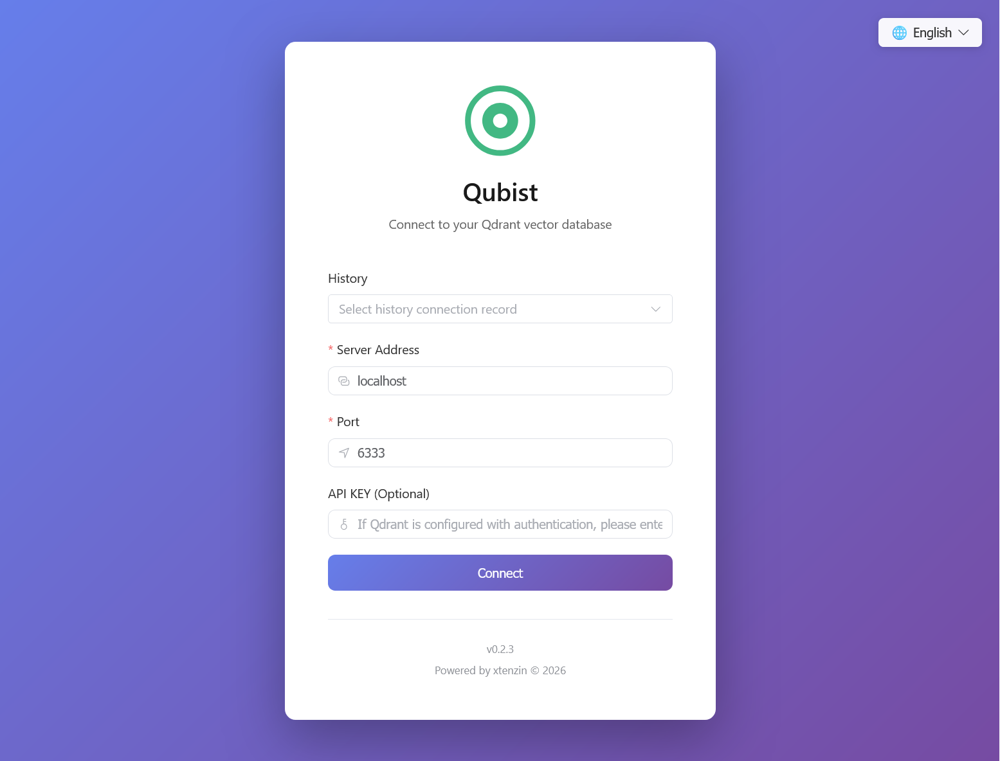
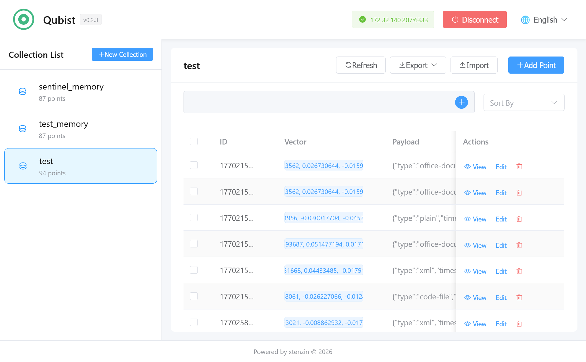
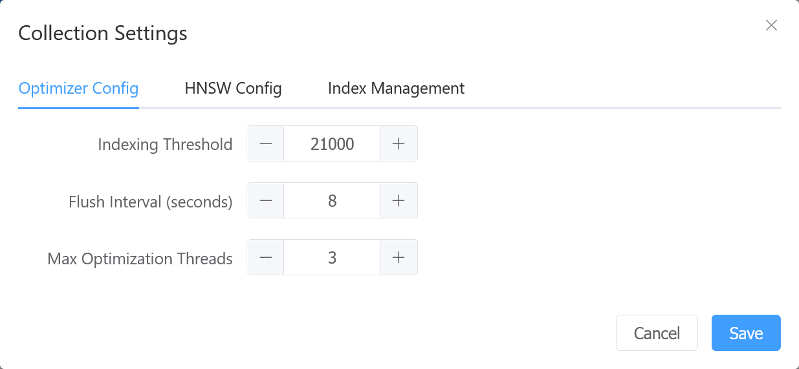
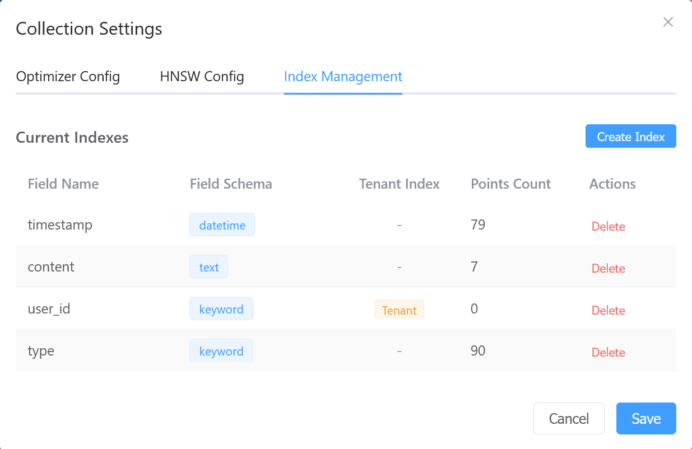
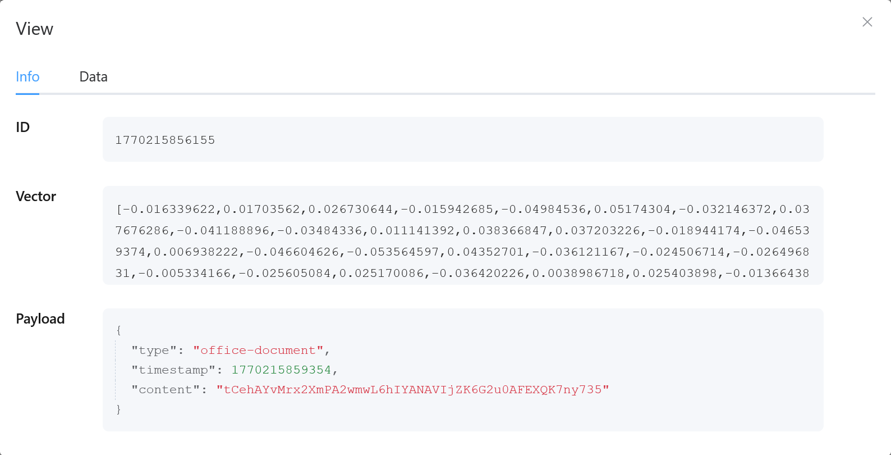
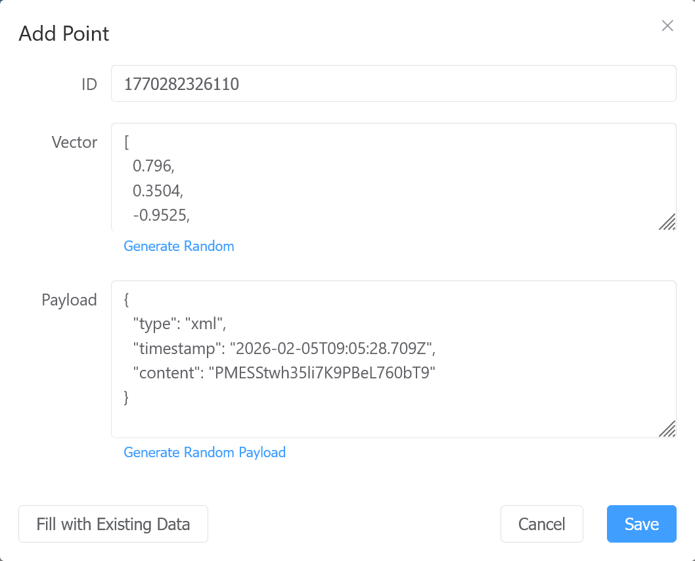
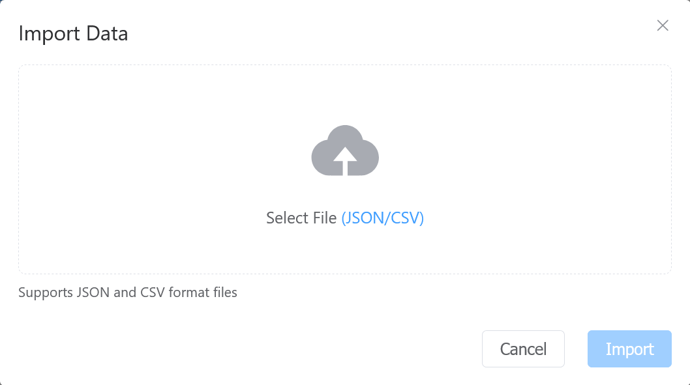

# Qubist

[English](README.md) | [中文](README_zh-CN.md)

[](https://github.com/xtenzin/Qubist/actions/workflows/ci.yml)
[](https://opensource.org/licenses/MIT)
[](https://github.com/xtenzin/Qubist)
[](https://nodejs.org/)

A Qdrant vector database web management tool developed with Vue 3 + TypeScript, providing a more user-friendly data management solution than the official interface.

**🌐 [Try Online Demo](https://xtenzin.github.io/Qubist/)** | **在线演示**: [https://xtenzin.github.io/Qubist/](https://xtenzin.github.io/Qubist/)

## Version

**Current Version**: 0.2.3

## Copyright

Copyright © 2026 xtenzin. All rights reserved.

**Contact**: xtenzin  
**Email**: code@xtenzin.com  
**Code Committer**: xtenzin <code@xtenzin.com>

## Overview

Qubist is a web-based management interface for Qdrant vector database, designed to simplify common data management operations. While the official Qdrant interface provides similar functionality, this tool aims to offer a more intuitive and user-friendly experience, especially for scenarios requiring quick data addition and management.

## Screenshots

### Login Page
The login page provides a clean interface for connecting to Qdrant servers, with support for multiple connection configurations and language switching.



### Dashboard
The main dashboard displays collections in a sidebar and provides comprehensive data management capabilities.



### Collection Settings
Manage collection configurations including basic settings and advanced parameters.



### Index Management
Create and manage payload indexes for efficient data querying and filtering.



### Data Operations
Complete CRUD operations for point data, including viewing, adding, and importing data.

#### View Data


#### Add Data


#### Import Data


## Features

### Connection Management
- Configure Qdrant server address, port, and optional API KEY
- Connection validation through Qdrant REST API
- Historical login record management with quick selection
- Connection state persistence

### Collection Management
- Display all collections in a sidebar list
- View collection information (basic and advanced)
- Collection settings management (indexes, etc.)
- Create new collections

### Data Operations
- Complete CRUD operations for point data
- Data list display with ID, vector, and Payload information
- View, add, edit, and delete point data
- Batch delete functionality with multi-select support
- Data import from JSON and CSV files
- Data export to JSON and CSV formats (current page, selected, query results, or all)
- Pagination support with customizable page sizes
- Data refresh functionality

### User Interface
- Clean and modern UI design
- Color scheme inspired by Qdrant official interface
- Responsive layout
- Intuitive user experience

### Internationalization
- Support for Simplified Chinese (zh-CN) and English (en-US)
- Automatic browser language detection
- Manual language switching via language switcher
- Language preference saved in browser localStorage
- Both login page and main interface support multi-language

## Technology Stack

### Core Framework
- **Vue 3**: Progressive JavaScript framework for building user interfaces
- **TypeScript**: Type-safe JavaScript superset for better development experience
- **Vite**: Fast development server and build tool

### UI Component Library
- **Element Plus**: A Vue 3 based component library providing rich UI components

### HTTP Client
- **Axios**: Promise-based HTTP client for making API requests

### State Management
- **Pinia**: Official state management solution for Vue 3, lightweight and type-safe

### Routing Management
- **Vue Router**: Official router for Vue.js, supporting route guards and navigation

### Internationalization
- **vue-i18n**: Vue.js internationalization plugin for multi-language support

### Code Quality
- **ESLint**: Code linting tool for maintaining code quality
- **Prettier**: Code formatter for consistent code style

## Project Structure

```
Qubist/
├── src/                    # Source code directory (Vue project)
│   ├── api/               # API encapsulation
│   ├── components/        # Vue components
│   ├── views/             # Page views
│   ├── stores/            # State management (Pinia)
│   ├── router/            # Route configuration
│   ├── i18n/              # Internationalization configuration
│   ├── locales/           # Language files (zh-CN, en-US)
│   ├── utils/             # Utility functions
│   ├── index.html         # Entry HTML file
│   ├── package.json       # Project configuration
│   ├── vite.config.ts     # Vite configuration
│   ├── tsconfig.json      # TypeScript configuration
│   ├── tsconfig.app.json  # TypeScript app configuration
│   ├── tsconfig.node.json # TypeScript node configuration
│   ├── App.vue            # Root component
│   └── main.ts            # Entry file
├── docs/                   # Documentation directory
│   ├── zh-CN/             # Chinese documentation
│   ├── en-US/             # English documentation
│   ├── README.md          # Documentation guide (English)
│   └── README_zh-CN.md    # Documentation guide (Chinese)
├── screenshots/            # Screenshots directory
│   ├── screenshot-*_en-US.png  # English screenshots
│   └── screenshot-*_zh-CN.png  # Chinese screenshots
├── LICENSE                # License file
├── README.md              # This file (English)
└── README_zh-CN.md        # Project description (Chinese)
```

## Quick Start

### Online Demo (GitHub Pages)

You can use Qubist directly online without installation. The latest version is automatically deployed to GitHub Pages:

**🌐 Online Demo**: [https://xtenzin.github.io/Qubist/](https://xtenzin.github.io/Qubist/)

#### Important Notes

**🔒 Security & Privacy**
- Qubist is a pure frontend application. All data processing happens in your browser.
- API keys and connection information are stored only in your browser's localStorage and never sent to any third-party servers.
- Your Qdrant server credentials remain completely private and are never transmitted to our servers.

**🌐 CORS & Mixed Content**
- The online demo runs on HTTPS (`https://xtenzin.github.io`). If you're connecting to a local Qdrant server (`http://localhost:6333`), you may encounter CORS or mixed content issues.
- **Solution**: Configure your local Qdrant server to allow cross-origin requests. Add the following to your Qdrant configuration:
  ```yaml
  service:
    enable_cors: true
    cors_allow_origins:
      - "https://xtenzin.github.io"
  ```
- Alternatively, use a Qdrant server that is accessible over HTTPS from the internet.

**⚠️ Recommended Usage**
- The online demo is best suited for testing and demonstration purposes.
- For production use or when working with sensitive data, consider deploying Qubist locally or on your own server.

### Local Installation

If you prefer to run Qubist locally, follow these steps:

1. Clone the repository:
```bash
git clone https://github.com/xtenzin/Qubist.git
cd Qubist
```

2. Navigate to the source code directory:
```bash
cd src
```

3. Install dependencies:
```bash
npm install
```

4. Start the development server:
```bash
npm run dev
```

5. Open your browser and navigate to `http://localhost:16333` (default port, paying tribute to Qdrant)

**Note**: All Vue project files (including `package.json`, `vite.config.ts`, etc.) are located in the `src/` directory. You need to run npm commands from within the `src/` directory.

## Configuration

On first access, you need to configure the Qdrant server connection information:

- **Server**: Qdrant server address (default: localhost)
- **Port**: Qdrant service port (default: 6333)
- **API KEY**: Optional, required if Qdrant is configured with authentication

### Login History

The system automatically records the last successful login configuration. You can quickly fill login parameters through dropdown selection, making it convenient to switch between different Qdrant instances.

## Documentation

For detailed documentation, please refer to the [docs](docs/) directory:

- [Documentation Guide (English)](docs/README.md)
- [文档指南（中文）](docs/README_zh-CN.md)
- [Technical Roadmap (English)](docs/en-US/technical-roadmap_en-US.md)
- [技术路线（中文）](docs/zh-CN/technical-roadmap_zh-CN.md)
- [Deployment Guide (English)](docs/en-US/deployment_en-US.md)
- [部署指南（中文）](docs/zh-CN/deployment_zh-CN.md)

## Development

### Code Comments
All code comments are bilingual:
- Chinese comments above
- English comments below

### Commit Standards
- Follow project Git commit conventions
- Commit messages use Chinese
- Commit by feature module

## License

See [LICENSE](LICENSE) file for details.

## Contact

**Author**: xtenzin  
**Email**: code@xtenzin.com
