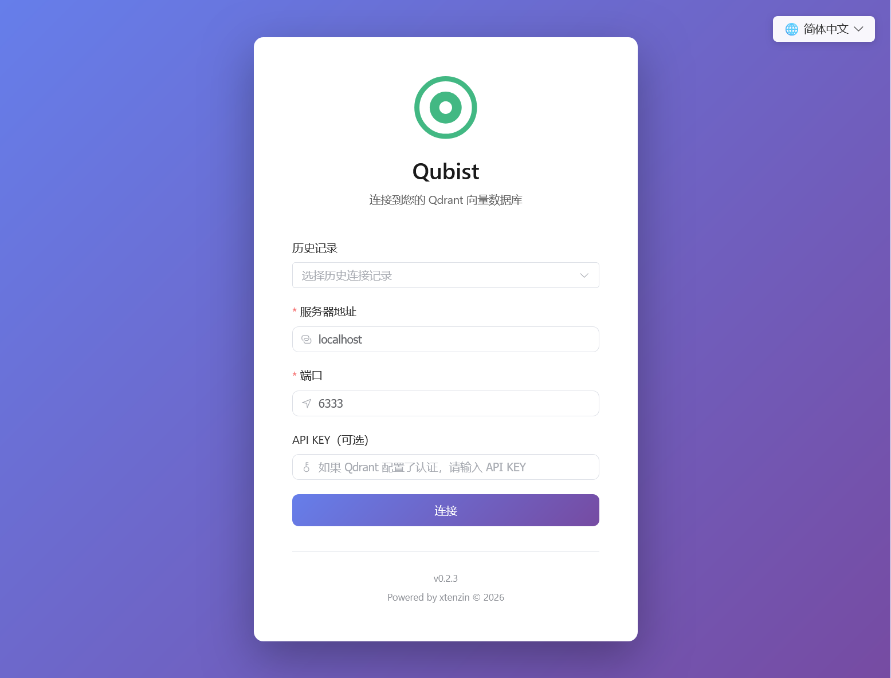
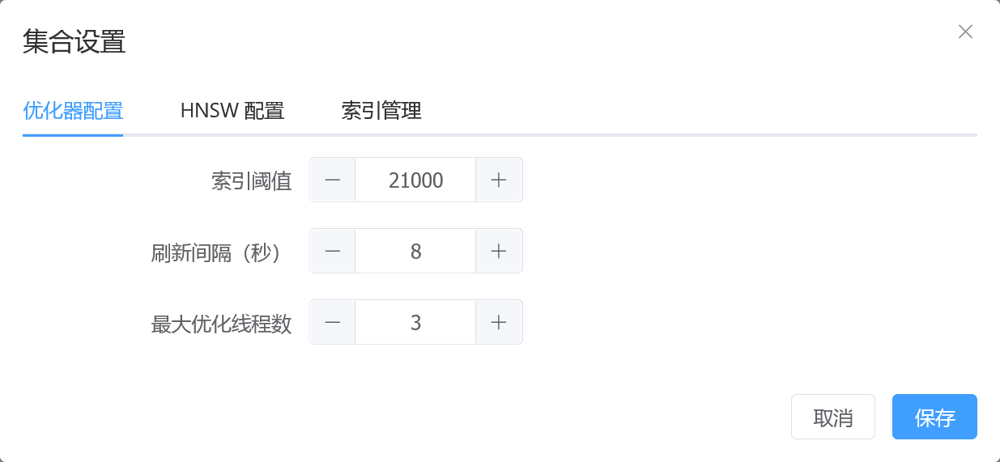
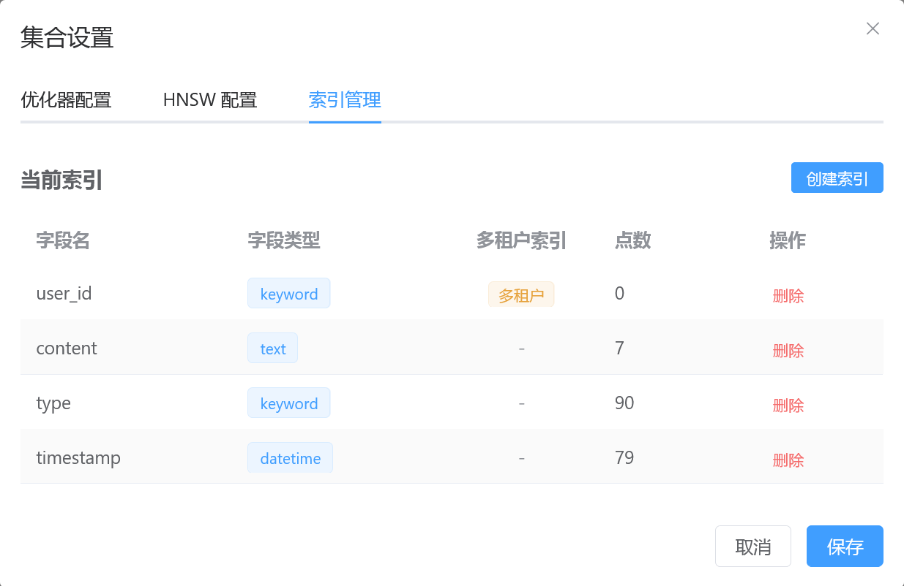
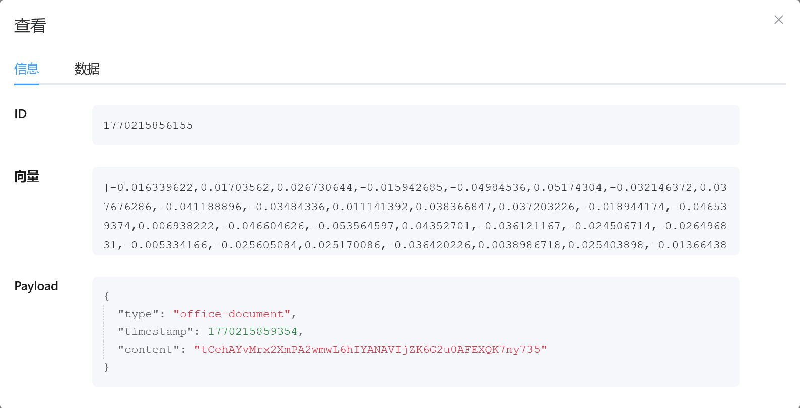
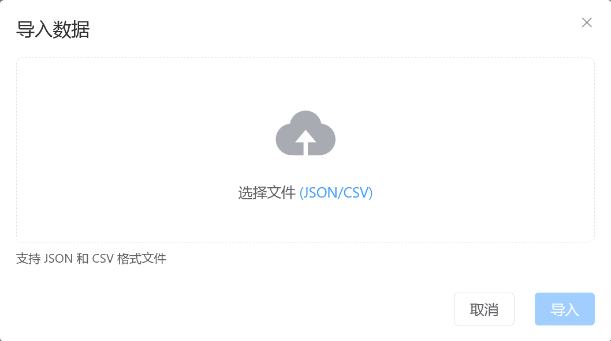

# Qubist

[English](README.md) | [中文](README_zh-CN.md)

[](https://github.com/xtenzin/Qubist/actions/workflows/ci.yml)
[](https://opensource.org/licenses/MIT)
[](https://github.com/xtenzin/Qubist)
[](https://nodejs.org/)

基于 Vue 3 + TypeScript 开发的 Qdrant 向量数据库 Web 管理工具，提供比官方界面更友好的数据管理方案。

**🌐 [在线演示](https://xtenzin.github.io/Qubist/)** | **Try Online Demo**: [https://xtenzin.github.io/Qubist/](https://xtenzin.github.io/Qubist/)

## 版本

**当前版本**: 0.2.3

## 版权

版权所有 © 2026 xtenzin。保留所有权利。

**联系人**: xtenzin  
**邮箱**: code@xtenzin.com  
**代码提交人**: xtenzin <code@xtenzin.com>

## 概述

Qubist 是一个基于 Web 的 Qdrant 向量数据库管理界面，旨在简化常见的数据管理操作。虽然官方 Qdrant 界面提供了类似的功能，但本工具旨在提供更直观、更友好的用户体验，特别适合需要快速添加和管理数据的场景。

## 截图展示

### 登录页面
登录页面提供了简洁的连接配置界面，支持多连接配置和语言切换。



### 主界面
主界面在侧边栏显示集合列表，并提供全面的数据管理功能。


### 集合设置
管理集合配置，包括基本设置和高级参数。



### 索引管理
创建和管理 payload 索引，用于高效的数据查询和筛选。



### 数据操作
完整的点数据 CRUD 操作，包括查看、添加和导入数据。

#### 查看数据


#### 添加数据


#### 导入数据


## 功能特性

### 连接管理
- 配置 Qdrant 服务器地址、端口和可选的 API KEY
- 通过 Qdrant REST API 进行连接验证
- 历史登录记录管理，支持快速选择
- 连接状态持久化

### 集合管理
- 在侧边栏列表中显示所有集合
- 查看集合信息（基本信息和高级信息）
- 集合设置管理（索引等）
- 创建新集合

### 数据操作
- 点数据的完整 CRUD 操作
- 数据列表显示，包含 ID、向量和 Payload 信息
- 查看、添加、编辑和删除点数据
- 批量删除功能，支持多选操作
- 从 JSON 和 CSV 文件导入数据
- 导出数据为 JSON 和 CSV 格式（支持导出本页、选中、查询结果或全部）
- 分页支持，可自定义每页大小
- 数据刷新功能

### 用户界面
- 简洁现代的 UI 设计
- 参考 Qdrant 官方界面的配色方案
- 响应式布局
- 直观的用户体验

### 多语种支持
- 支持简体中文（zh-CN）和英文（en-US）
- 自动检测浏览器语言并应用对应语言
- 用户可通过语言切换器手动切换语言
- 语言选择保存在浏览器 localStorage，下次打开自动应用
- 登录页面和主界面均支持多语种切换

## 技术栈

### 核心框架
- **Vue 3**: 用于构建用户界面的渐进式 JavaScript 框架
- **TypeScript**: 类型安全的 JavaScript 超集，提供更好的开发体验
- **Vite**: 快速的开发服务器和构建工具

### UI 组件库
- **Element Plus**: 基于 Vue 3 的组件库，提供丰富的 UI 组件

### HTTP 客户端
- **Axios**: 基于 Promise 的 HTTP 客户端，用于发起 API 请求

### 状态管理
- **Pinia**: Vue 3 官方推荐的状态管理方案，轻量级且类型安全

### 路由管理
- **Vue Router**: Vue.js 官方路由管理器，支持路由守卫和导航

### 国际化
- **vue-i18n**: Vue.js 国际化插件，支持多语种切换

### 代码质量
- **ESLint**: 代码检查工具，用于维护代码质量
- **Prettier**: 代码格式化工具，确保代码风格一致

## 项目结构

```
Qubist/
├── src/                    # 源代码目录（Vue 项目）
│   ├── api/               # API 封装
│   ├── components/        # Vue 组件
│   ├── views/             # 页面视图
│   ├── stores/            # 状态管理（Pinia）
│   ├── router/            # 路由配置
│   ├── i18n/              # 国际化配置
│   ├── locales/           # 语言文件（zh-CN, en-US）
│   ├── utils/             # 工具函数
│   ├── index.html         # 入口 HTML 文件
│   ├── package.json       # 项目配置
│   ├── vite.config.ts     # Vite 配置
│   ├── tsconfig.json      # TypeScript 配置
│   ├── tsconfig.app.json  # TypeScript 应用配置
│   ├── tsconfig.node.json # TypeScript Node 配置
│   ├── App.vue            # 根组件
│   └── main.ts            # 入口文件
├── docs/                   # 文档目录
│   ├── zh-CN/             # 中文文档
│   ├── en-US/             # 英文文档
│   ├── README.md          # 文档指南（英文）
│   └── README_zh-CN.md    # 文档指南（中文）
├── screenshots/            # 截图目录
│   ├── screenshot-*_en-US.png  # 英文截图
│   └── screenshot-*_zh-CN.png  # 中文截图
├── LICENSE                # 许可证文件
├── README.md              # 项目说明（英文）
└── README_zh-CN.md        # 本文件（中文）
```

## 快速开始

### 在线使用（GitHub Pages）

您可以直接在线使用 Qubist，无需安装。最新版本会自动部署到 GitHub Pages：

**🌐 在线演示**: [https://xtenzin.github.io/Qubist/](https://xtenzin.github.io/Qubist/)

> **注意**：使用在线版本时，需要确保您的 Qdrant 服务器可以从互联网访问，或使用允许 CORS 请求的 Qdrant 服务器。出于安全考虑，建议仅将在线版本用于测试或与受信任的 Qdrant 实例一起使用。

### 本地安装

如果您希望本地运行 Qubist，请按照以下步骤操作：

1. 克隆仓库：
```bash
git clone https://github.com/xtenzin/Qubist.git
cd Qubist
```

2. 进入源代码目录：
```bash
cd src
```

3. 安装依赖：
```bash
npm install
```

4. 启动开发服务器：
```bash
npm run dev
```

5. 打开浏览器并访问 `http://localhost:16333`（默认端口，致敬 Qdrant）

**注意**：所有 Vue 项目文件（包括 `package.json`、`vite.config.ts` 等）都位于 `src/` 目录中。您需要在 `src/` 目录内运行 npm 命令。

## 配置

首次访问时，需要配置 Qdrant 服务器的连接信息：

- **服务器**: Qdrant 服务器地址（默认值：localhost）
- **端口**: Qdrant 服务端口（默认值：6333）
- **API KEY**: 可选，如果 Qdrant 配置了认证则需要填写

### 登录历史记录

系统会自动记录上次成功登录的配置信息。通过下拉选择可快速填充登录参数，方便快速切换不同的 Qdrant 实例。

## 文档

详细文档请参考 [docs](docs/) 目录：

- [文档指南（中文）](docs/README_zh-CN.md)
- [Documentation Guide (English)](docs/README.md)
- [技术路线（中文）](docs/zh-CN/technical-roadmap_zh-CN.md)
- [Technical Roadmap (English)](docs/en-US/technical-roadmap_en-US.md)
- [部署指南（中文）](docs/zh-CN/deployment_zh-CN.md)
- [Deployment Guide (English)](docs/en-US/deployment_en-US.md)

## 开发

### 代码注释
所有代码注释均为双语：
- 中文注释在上
- 英文注释在下

### 提交规范
- 遵循项目的 Git 提交约定
- 提交消息使用中文
- 按功能模块进行提交

## 许可证

详情请参阅 [LICENSE](LICENSE) 文件。

## 联系方式

**作者**: xtenzin  
**邮箱**: code@xtenzin.com
